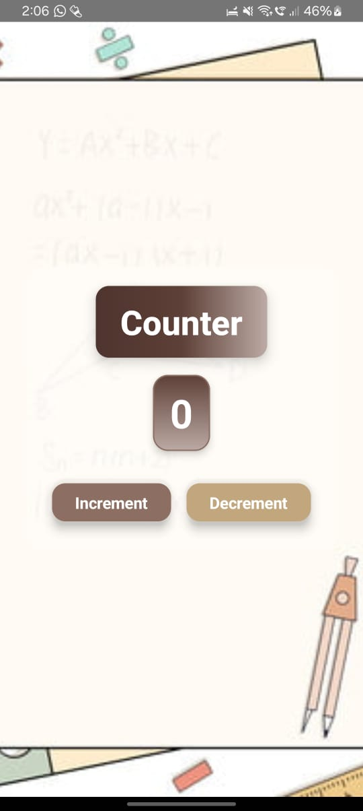

---

# **📱 Counter App (Kotlin & Jetpack Compose)**  
A modern, minimalistic **Counter App** built using **Kotlin** and **Jetpack Compose**, following the **MVVM architecture** for clean and maintainable code.  

## 🎯 **Features**  
✅ **Increment Counter** – Tap to increase the counter value.  
✅ **Decrement Counter** – Tap to decrease the counter value.  
✅ **Reset Counter** – Reset the counter back to zero with a single click.  
✅ **Modern UI** – Smooth and reactive UI built using **Jetpack Compose**.  
✅ **Aesthetic Design** – Beautiful background and material design elements.  

## 🛠️ **Tech Stack**  
- **Programming Language:** Kotlin  
- **UI Toolkit:** Jetpack Compose  
- **Architecture:** MVVM (Model-View-ViewModel)  

## 🚀 **Getting Started**  
To run the project locally, follow these steps:  

### 1️⃣ Clone the repository:  
```sh
git clone https://github.com/ishansaxena012/counter-app.git
```
### 2️⃣ Open the project in **Android Studio**.  
### 3️⃣ Build & Run the project on an **emulator or physical device**.  

## 💡 **Architecture Overview**  
The app follows the **MVVM** (Model-View-ViewModel) architecture, ensuring better separation of concerns, modularity, and maintainability:  

- **Model (M):** Handles data and business logic.  
- **View (V):** Displays UI elements using **Jetpack Compose**.  
- **ViewModel (VM):** Manages UI-related data and business logic.  

## 🖼️ **Screenshots**  
### App UI:  
  

## 🤝 **Contributing**  
Contributions are always welcome! 🚀  

If you'd like to improve or extend the app, feel free to:  
1. **Fork** the repository  
2. **Create a new branch**  
3. **Submit a pull request** with your improvements  

---  

💻 **Happy Coding!** 😃🎉  

---
